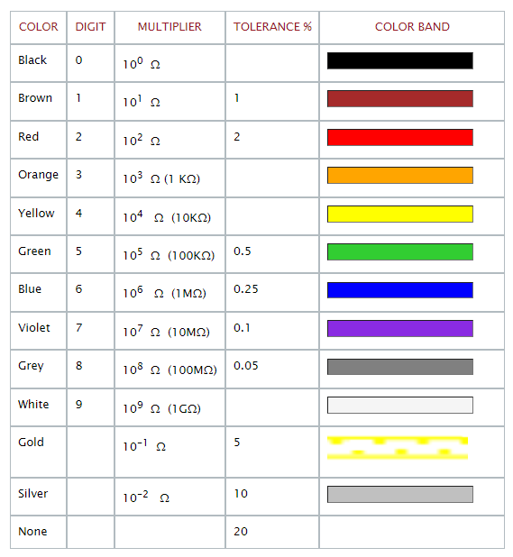

## Color Code for Resistor
<!--div align="left">                        
                                 
</div-->

Color | Digit | Multiplier | Tolerence%  | Color Band | 
:--|:--|:--|:--|:--|
Black | 0 |  $$10^0 \quad \ohm$$ | | <input type="text" style="background-color:black" > | 
Brown | 0 |  $$10^1 \quad \ohm$$ | 1 | <input type="text" style="background-color:brown" > | 
Red | 0 |  $$10^1 \quad \ohm$$ | 2 | <input type="text" style="background-color:red" > | 
Orange | 0 |  $$10^3 \quad \ohm \quad (1K\ohm)$$ | | <input type="text" style="background-color:orange" > | 
Yellow | 0 |  $$10^4 \quad \ohm \quad (10K\ohm)$$ | | <input type="text" style="background-color:yellow" > | 
Green | 0 |  $$10^5 \quad \ohm \quad (100K\ohm)$$ | 0.5 | <input type="text" style="background-color:limegreen" > | 
Blue | 0 |  $$10^6 \quad \ohm \quad (1M\ohm)$$ | 0.25 | <input type="text" style="background-color:blue" > | 
Violet | 0 |  $$10^7 \quad \ohm \quad (10M\ohm)$$ | 0.1 | <input type="text" style="background-color:blueviolet" > | 
Grey | 0 |  $$10^8 \quad \ohm \quad (100M\ohm)$$ | 0.05 | <input type="text" style="background-color:grey" > | 
White | 0 |  $$10^9 \quad \ohm \quad (1G\ohm)$$ | | <input type="text" style="background-color:whitesmoke" > | 
Gold | 0 |  $$10^-1 \quad \ohm$$ | 5 | <input type="text" style="background-color:gold" > | 
Silver | 0 |  $$10^-2 \quad \ohm$$ | 10 | <input type="text" style="background-color:silver" > | 
None | 0 |   | 20 | <input type="text" style="background-color:none" > | 

