# Theory

## Types of Resistors

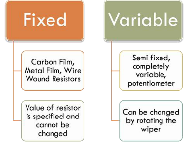

Figure: 1 

## Reading Value of Fixed Resistors

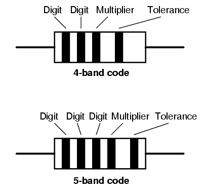

Figure: 2.1 

- Resistors are color coded as they are too small for the value to be written on them.
- There are 4 or 5 bands of color . Value of a Resistor is decoded from these band of colors.

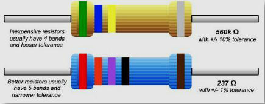

Figure: 2.2 

### Reading Value:Step 1

- If your resistor has four color bands ,turn the resistor so that the gold or silver band is on right hand side or the end with more bands should point left.

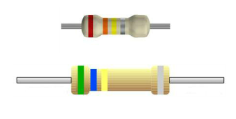

Figure: 3 

### Reading Value:Step 2

The first band is now on the left hand side. This represents the first digit .Based on the color make a note of the digit.In this case- 4 band its ‘5’ and for 5 band its ‘2’.

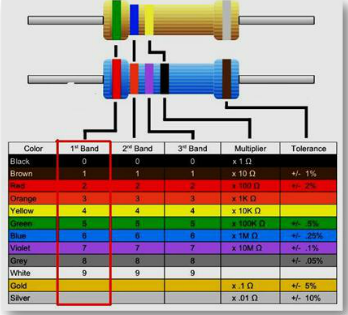

Figure: 4 

### Reading Value :Step 3

The second band represents the second digit. The colors represent the same numbers as did the first digit .In this case -4 band its’6’ and for 5 band its’3’.

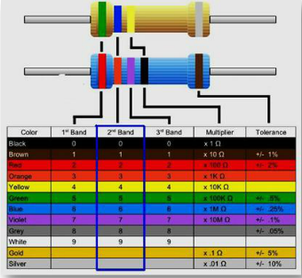

Figure: 5 

### Reading Value : Step 4

The third band divulges how many zeros to add/divide to the first two numbers –for a 4 band Resistor . In this case – 4 band its ‘4’ zeroes to be added . So value is 560K.

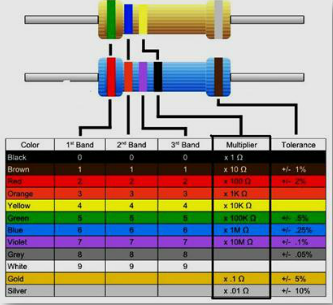

Figure: 6 

### Reading Value : Step 5

The third band denotes the 3rd digit – for a 5 band Resistor. In this case -5 band its ‘7’ . So the value of the 5 band resistor is 237 Ohms as its multipier digit is ‘0.

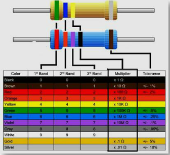

Figure: 7 

### Tolerance

The last band denotes the tolerance . So the value of the 4 band resistor it is +/- 10% while for the 5 band resistor it is +/- 1%.

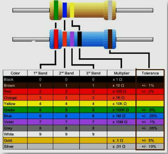

Figure: 8 

- Tolerance of a Resistor is also an important property to consider .
- A 100 ohm resistor with a 10 % tolerance can mean its value can be any fixed value between 90 to 110 Ohms.
- A 120 Ohm resistor with a 10 % tolerance can mean its value can be any fixed value between 108 and 132 Ohms.
- So there is some overlap between 100 Ohm and 120 Ohm resistance in terms of its limits.

## Mnemonic to Remember

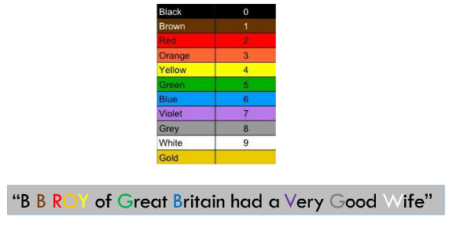

Figure: 9.1 

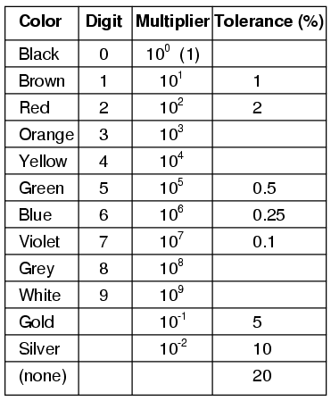

Figure: 9.2 

### Carbon Film Resistors

- Most general purpose ,cheap resistor
- Tolerance of Resistance value is usually +/- 5%
- Power ratings of 1/8 W ,1/4 W and ½ W are usually used
- Con:Tend to be electrically noisy

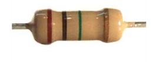

Figure: 10 

### Metal Film Resistor

- Used when higher tolerance is needed , ie more value.
- They have about +/- 0.05% tolerance

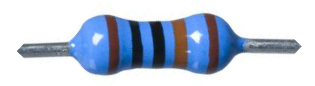

Figure: 11 

### Wire Wound Resistors
- A wire wound resistor is made of metal resistance wire, and because of this they can be manufactured to precise values
- Also, high wattage resistors can be made by thick wire material
- Wire wound resistors in a ceramic case are called as ceramic resistors
- Wire wound resistors in a ceramic case are called as ceramic resistors

## Color Code for Resistor
<!--div align="left">                        
    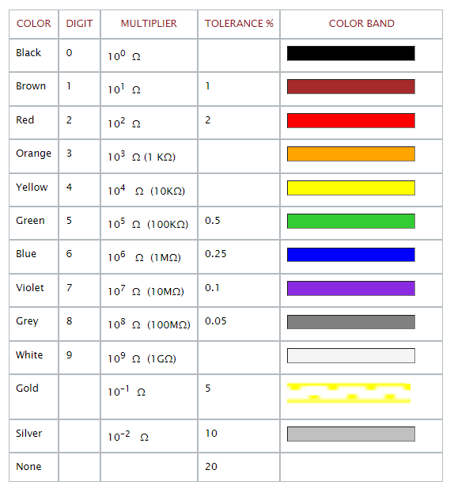                             
</div-->

Color | Digit | Multiplier | Tolerence%  | Color Band | 
:--|:--|:--|:--|:--|
Black | 0 |  \\( \quad 10^0 \quad \ohm \quad \\) | | <input type="text" style="background-color:black" > | 
Brown | 0 |  $$10^1\quad\ohm$$ | 1 | <input type="text" style="background-color:brown" > | 
Red | 0 |  $$10^1 \quad\ohm$$ | 2 | <input type="text" style="background-color:red" > | 
Orange | 0 |  $$10^3 \quad \ohm \quad (1K\ohm)$$ | | <input type="text" style="background-color:orange" > | 
Yellow | 0 |  $$10^4 \quad \ohm \quad (10K\ohm)$$ | | <input type="text" style="background-color:yellow" > | 
Green | 0 |  $$10^5 \quad \ohm \quad (100K\ohm)$$ | 0.5 | <input type="text" style="background-color:limegreen" > | 
Blue | 0 |  $$10^6 \quad \ohm \quad (1M\ohm)$$ | 0.25 | <input type="text" style="background-color:blue" > | 
Violet | 0 |  $$10^7 \quad \ohm \quad (10M\ohm)$$ | 0.1 | <input type="text" style="background-color:blueviolet" > | 
Grey | 0 |  $$10^8 \quad \ohm \quad (100M\ohm)$$ | 0.05 | <input type="text" style="background-color:grey" > | 
White | 0 |  $$10^9 \quad \ohm \quad (1G\ohm)$$ | | <input type="text" style="background-color:whitesmoke" > | 
Gold | 0 |  $$10^{-1} \quad \ohm$$ | 5 | <input type="text" style="background-color:gold" > | 
Silver | 0 |  $$10^{-2} \quad \ohm$$ | 10 | <input type="text" style="background-color:silver" > | 
None | 0 |   | 20 | <input type="text" style="background-color:none" > | 

### Slides of the above theory

- Slides:   [Measurements of  Resistance](http://vlabs.iitkgp.ac.in/be/exp1/content/slides.html)

- Pdf:  [Measurements of  Resistance](http://vlabs.iitkgp.ac.in/be/exp1/content/measureresis.pdf)

